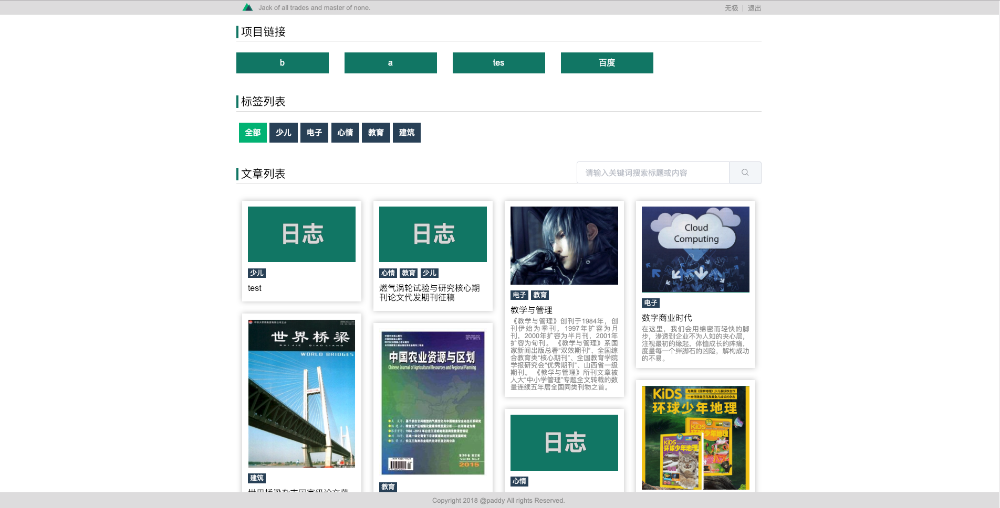
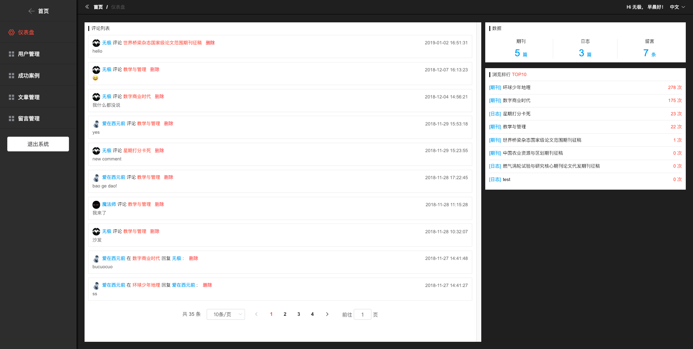
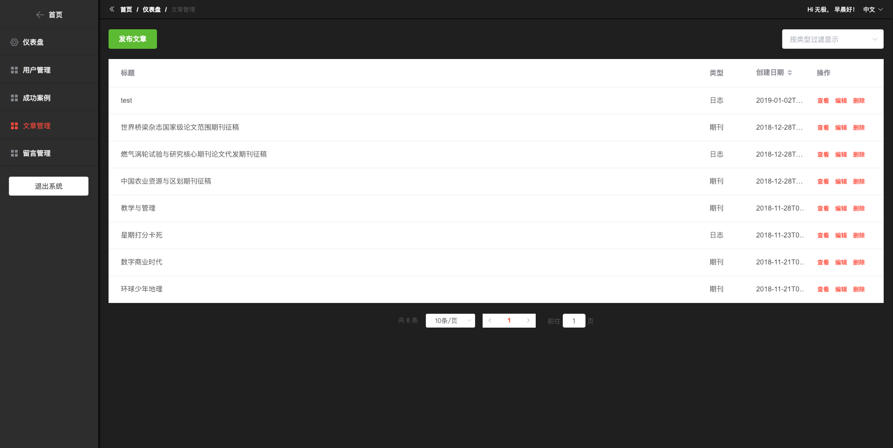
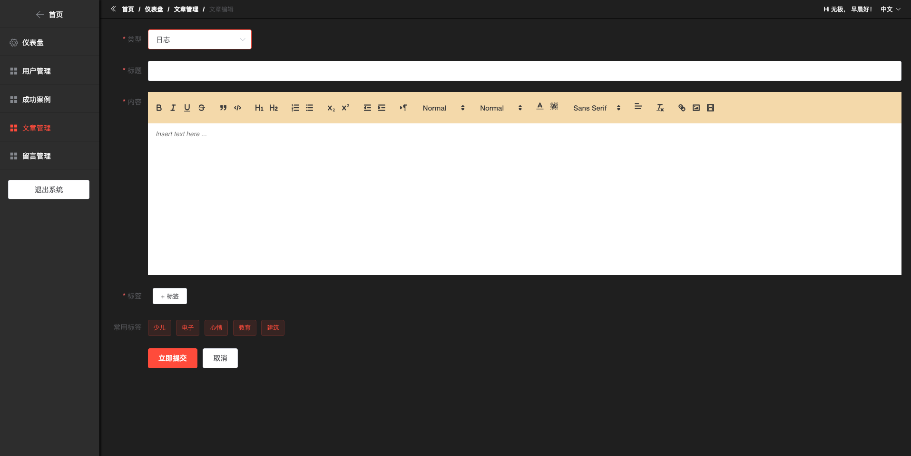

## Nuxt-CMS

#### 前端

#### 后台首页

#### 文章管理

#### 发布文章


#### 功能实现
> 完整的用户注册，登录，退出，登录验证，重置密码等功能

> 用户管理，更改用户权限。用户角色分为超级管理员，管理员，用户

> 多语言界面配置

> 简单的数据统计功能，如文章数量，文章的阅读量，点击排行

> 校验Token登录状态

> 可以发布两种资讯类型：带缩略图的期刊型资讯和不带缩略图的日志型

> 发布文章，点赞，发布评论，回复评论功能

> 管理员管理文章，删除文章，删除评论等功能

> 留言功能

> 合作伙伴

> 离线缓存PWA，渐进式网页应用

#### 技术面

> 基于Nuxt内容管理系统，Koa web服务，Mongoose mongodb数据存储，i18n多语言，SSR服务端渲染，PWA渐进式WebApp应用

> 包含前端通用基础样式，以及js常用工具类合集

> 包含前端框架elementUI和手机框架MintUI

> 本架构使用Babel6编译

``` 
# 开发模式
yarn 
yarn dev

# 部署测试环境
yarn build:uat
pm2 start --env uat

# 部署生产环境
yarn build:production
pm2 start --env production

# 更新
pm2 restart NAME
pm2 reload ecosystem.config.js --env ENVIROMENT
```

## config.js

```
let env =  process.env.__ENV

console.log('env:',process.env.__ENV)

module.exports = {
  secret: 'nuxt-koa-mongoose-pwa',
  app: {
    domain: env === 'production' ? 'https://PRODUCTION.com' : (env === 'uat' ? 'https://UAT.com' : 'http://localhost:3000'),
    host: '0.0.0.0',
    port: 3000
  },
  admin: {
    role: '超级管理员',
    username: 'paddy',
    password: 'paddy',
    name: 'paddy',
    email: 'patricknieh@qq.com'
  },
  mongodb: {
    host: '127.0.0.1',
    database: 'nuxt-cms',
    port: 27017,
    username: '',
    password: ''
  },
  SMTPConfig: {
    user: '',
    pass: ''
  }
}
```

> 注：config.js不被git记录，需要自己添加此文件

### 开源协议

[GPL-3.0](https://choosealicense.com/licenses/gpl-3.0/)  
